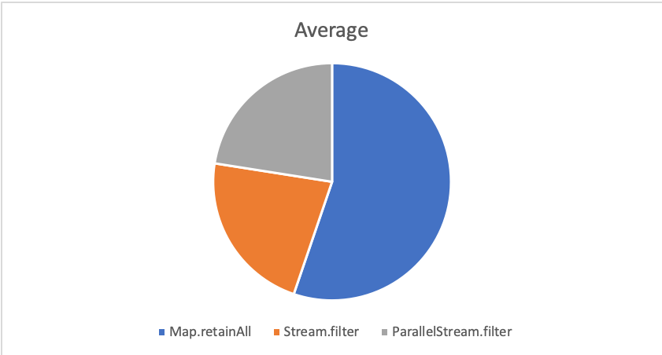
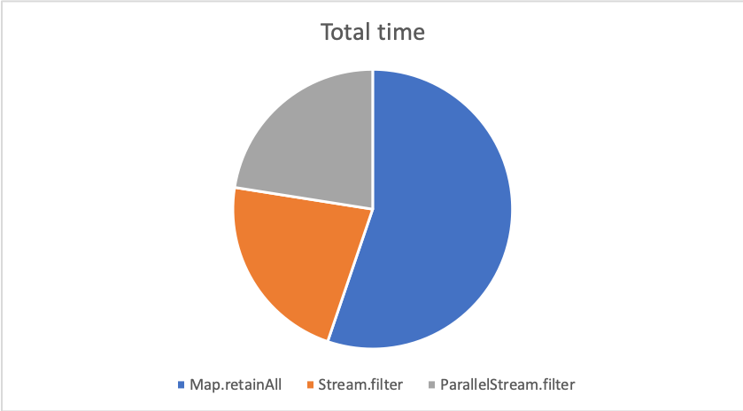

# MapFilterTest

> Simple java test project to investigate* a performance question that came up with Myself and some colleagues.

## Description
To measure this, I created a simple test that creates a Map of fixed size, after this a series of 'tests' are created and stored in `TEST_FILTERS`. By doing this, the aim was to set up a random data set that could be shared among the 3 different 'algorithms' and therefore create some common conditions to measure the performance of each.

There were 2 different ways identified that the problem could be solved.
1. Through using `retainAll` on the key set (First, creating a temporary copy so as not to modify the original map).
2. Through using `stream().filter()` on the original map.

## Results

* The test was carried out on my local machine (2015 MacBook Pro - 8GB RAM).
* I used a `DATA_SIZE` size of 10,000.
* In my test run, `TEST_FILTERS` contained 2634 randomly generated elements.

The results observed by myself are as below, I found the use of `.stream().filter(...)` to be roughly twice as fast, when taking an average of all 2364 iterations across the 3 runs.

* Motivation for this test was purely to prove someone wrong. For anonymity the backers of each solution will not be named.